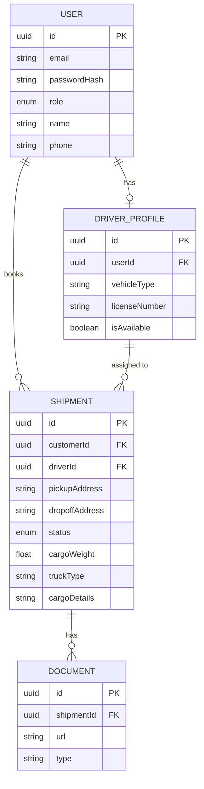

```mermaid
erDiagram
    USER {
        uuid id PK
        string email
        string passwordHash
        enum role
        string name
        string phone
    }
    DRIVER_PROFILE {
        uuid id PK
        uuid userId FK
        string vehicleType
        string licenseNumber
        boolean isAvailable
    }
    SHIPMENT {
        uuid id PK
        uuid customerId FK
        uuid driverId FK
        string pickupAddress
        string dropoffAddress
        enum status
        float cargoWeight
        string truckType
        string cargoDetails
    }
    DOCUMENT {
        uuid id PK
        uuid shipmentId FK
        string url
        string type
    }
    USER ||--o{ SHIPMENT : "books"
    USER ||--o| DRIVER_PROFILE : "has"
    DRIVER_PROFILE ||--o{ SHIPMENT : "assigned to"
    SHIPMENT ||--o{ DOCUMENT : "has"
```
